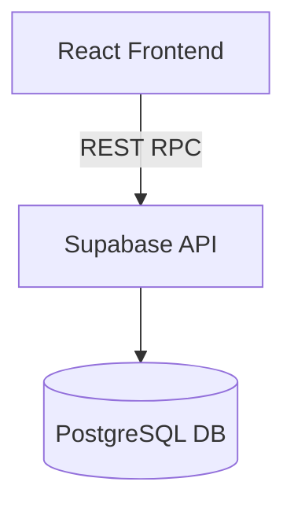

# Architecture Overview

The application uses Supabase as the backend. Requests from the Vite
frontend communicate with Supabase's REST API or via the client SDK.
Supabase enforces Row Level Security on all tables.
